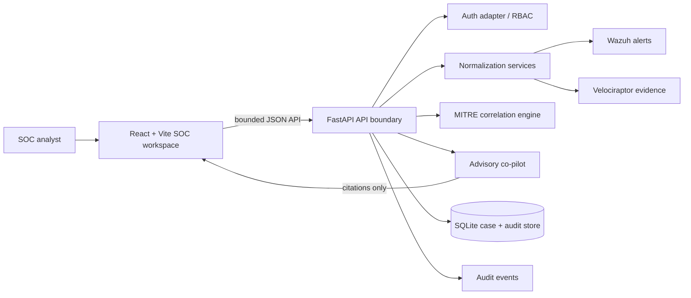

# Sentroxis Copilot

Sentroxis Copilot is a production-oriented incident-response workspace for security operations teams. It presents Wazuh signals, Velociraptor evidence workflows, MITRE ATT&CK correlation, and an evidence-grounded AI advisory surface in one dark SOC command center.

The repository is intentionally **read-only-first**. Demo telemetry is treated as untrusted data, AI output is advisory-only, and every future containment action must remain behind server-side authorization, explicit approval, deterministic policy checks, and an audit record.

## Architecture



```mermaid
sequenceDiagram
  participant W as Wazuh
  participant N as Normalizer
  participant A as API
  participant M as MITRE engine
  participant C as Co-pilot
  participant H as Human analyst

  W->>N: Alert payload (untrusted)
  N->>M: Stable internal Alert model
  M-->>A: Tactic, technique, confidence
  A->>C: Minimum required alert context
  C-->>A: Structured advisory with evidence refs
  A-->>H: Summary, citations, next read-only step
  H->>A: Create investigation / propose action
  A-->>H: Audit-linked result; no automatic execution
```

## Repository layout

```text
sentroxis-copilot/
├── README.md
├── setup_and_test.sh
├── backend/
│   ├── main.py
│   ├── requirements.txt
│   ├── core/
│   │   ├── auth.py
│   │   ├── llm_agent.py
│   │   ├── mitre_engine.py
│   │   └── models.py
│   ├── ingestion/
│   │   ├── velociraptor_service.py
│   │   └── wazuh_service.py
│   ├── mock_data/sample_alerts.json
│   └── tests/
│       ├── test_api.py
│       └── test_ingestion.py
└── frontend/
    ├── package.json
    ├── vite.config.js
    └── src/
        ├── components/
        │   ├── AnimatedCard.jsx
        │   └── Navbar.jsx
        ├── pages/
        │   ├── AIChat.jsx
        │   ├── Dashboard.jsx
        │   ├── Velociraptor.jsx
        │   └── Wazuh.jsx
        └── tests/App.test.jsx
```

## Local development

The project targets Python 3.10+ and a current Node.js runtime. The shortest path is:

```bash
chmod +x setup_and_test.sh
./setup_and_test.sh
```

The script creates or refreshes `backend/.venv`, installs the pinned Python dependencies, installs the frontend dependencies, runs Pytest and Vitest, and only starts the FastAPI and Vite development servers if both suites pass. The API is available at `http://localhost:8000` and the frontend at `http://localhost:5173`.

To run the services separately after setup:

```bash
source backend/.venv/bin/activate
PYTHONPATH=. uvicorn backend.main:app --reload --port 8000
```

```bash
cd frontend
npm run dev
```

## Demo workflow

Open the frontend and select **Wazuh signals** or **AI co-pilot** from the sidebar. The interface ships with a curated offline signal set so the experience does not depend on external image hosts, vendor credentials, or production telemetry. The API also exposes `POST /api/demo/load` for loading the same style of bounded demo records into SQLite.

The default local authentication adapter allows a local analyst when `SENTROXIS_DEV_MODE=true`. For a protected environment, set `SENTROXIS_DEV_MODE=false` and provide a real authentication adapter before exposing the API. A temporary demo token can be configured with `SENTROXIS_DEMO_TOKEN`; tokens must never be committed or logged.

## API surface

| Endpoint | Purpose | Mutating | Approval required |
|---|---|---:|---:|
| `GET /api/health` | Service health check | No | No |
| `GET /api/alerts` | Bounded, filterable normalized alert list | No | No |
| `POST /api/alerts/ingest` | Ingest and normalize a Wazuh/demo payload | Yes | Analyst authentication |
| `POST /api/demo/load` | Load offline demo signals | Yes | Analyst authentication |
| `GET /api/alerts/{id}/analysis` | Generate an advisory analysis | No | Analyst authentication |
| `POST /api/investigations` | Create an investigation with an initial timeline event | Yes | Analyst authentication |
| `POST /api/alerts/{id}/evidence` | Generate a bounded demo evidence record | Yes | Analyst authentication |
| `POST /api/chat` | Ask the advisory co-pilot a cited question | No | Analyst authentication |
| `POST /api/actions/proposals` | Record an approval-gated response proposal | Yes | Analyst authentication |
| `GET /api/audit` | Review audit events | No | Analyst authentication |

## Security design notes

The application keeps vendor-shaped payloads inside dedicated normalizers and exposes stable Pydantic models to the rest of the system. Inputs are bounded by field lengths, collection results are hashed, evidence includes provenance, and SQLite queries use parameter binding. CORS is explicit rather than wildcarded, and the demo service does not execute VQL, shell commands, or AI-generated instructions.

For a production integration, replace the demo auth adapter with OIDC/JWT validation, separate Wazuh Server API and Indexer clients, use a least-privilege service account, enforce TLS verification and timeouts, add rate limits and structured request IDs, and migrate SQLite to a managed database with encrypted backups. Add a queue for ingestion volume, a secrets manager, signed webhook verification, tenant-aware authorization, and a durable evidence vault before handling production data.

The co-pilot is deliberately structured around an advisory contract. Model output must be validated, cite alert/evidence references, and pass a deterministic policy layer before it could even become a proposal. A response proposal is never an execution request, and the API rejects proposals that do not explicitly require approval.

## Validation

Backend tests cover Wazuh normalization, severity mapping, ATT&CK correlation, health, ingestion, analysis citations, investigation creation, evidence hashing, prompt-injection resistance, missing resources, and approval gates. Frontend tests cover the branded overview, navigation landmarks, key metrics, and the MITRE matrix. The UI includes reduced-motion handling, visible focus states, semantic headings, non-color severity labels, and explicit AI/advisory language.

```bash
PYTHONPATH=. backend/.venv/bin/pytest -q backend/tests
cd frontend && npm test -- --run && npm run build
```

## GitHub Push Execution

From the repository root, run the following commands to create a new **public** repository and push the working tree:

```bash
cd /home/ubuntu/sentroxis-copilot
git init
git add .
git commit -m "Build Sentroxis Copilot incident response workspace"
gh repo create sentroxis-copilot --public --source=. --remote=origin
git push -u origin HEAD
```
