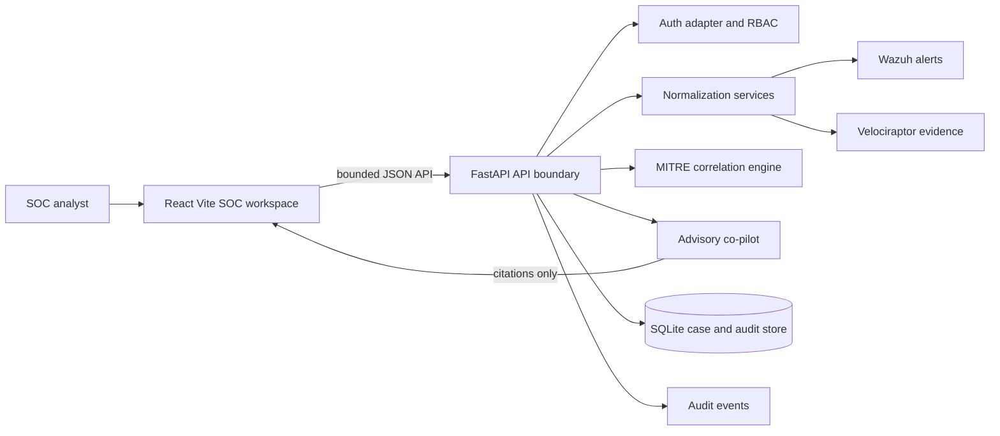
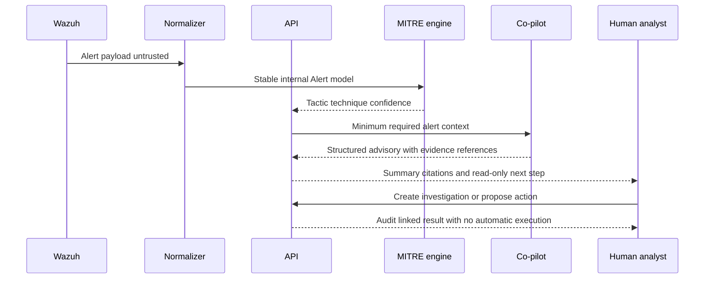

# Sentroxis Copilot

Sentroxis Copilot is a production-oriented incident-response workspace for security operations teams. It presents Wazuh signals, Velociraptor evidence workflows, MITRE ATT&CK correlation, and an evidence-grounded AI advisory surface in one dark SOC command center.

The repository is intentionally **read-only-first**. Demo telemetry is treated as untrusted data, AI output is advisory-only, and every future containment action must remain behind server-side authorization, explicit approval, deterministic policy checks, and an audit record.

## Architecture





## Repository layout

```text
sentroxis-copilot/
├── README.md
├── setup_and_test.sh
├── backend/
│   ├── main.py
│   ├── requirements.txt
│   ├── core/
│   │   ├── auth.py
│   │   ├── llm_agent.py
│   │   ├── mitre_engine.py
│   │   └── models.py
│   ├── ingestion/
│   │   ├── velociraptor_service.py
│   │   └── wazuh_service.py
│   └── tests/
│       ├── test_api.py
│       └── test_ingestion.py
└── frontend/
    ├── package.json
    ├── vite.config.js
    └── src/
        ├── components/
        │   ├── AnimatedCard.jsx
        │   └── Navbar.jsx
        ├── pages/
        │   ├── AIChat.jsx
        │   ├── Dashboard.jsx
        │   ├── Velociraptor.jsx
        │   └── Wazuh.jsx
        └── tests/App.test.jsx
```

## Local development

The project targets Python 3.10+ and a current Node.js runtime. The backend requirement range uses Pydantic 2.12+ because that release line includes initial Python 3.14 support. If an earlier interrupted attempt left a partial environment, the setup script can be rerun safely because it removes and recreates `backend/.venv` before installation. The shortest path is:

```bash
chmod +x setup_and_test.sh
./setup_and_test.sh
```

The script checks that the checkout includes the Python 3.14 compatibility fix, creates or refreshes `backend/.venv`, installs the Python dependencies from binary wheels, installs the frontend dependencies, runs Pytest and Vitest, and only starts the FastAPI and Vite development servers if both suites pass. If the checkout is stale, it stops immediately with a `git pull origin main` instruction instead of attempting a Rust source build. The API is available at `http://localhost:8000` and the frontend at `http://localhost:5173`.

To run the services separately after setup:

```bash
source backend/.venv/bin/activate
PYTHONPATH=. uvicorn backend.main:app --reload --port 8000
```

```bash
cd frontend
npm run dev
```

## Authenticated workflow

Open the frontend and sign in with an authenticated workspace account. The first account can be created during initial setup and becomes the workspace administrator. The dashboard starts with honest empty states until Wazuh or Velociraptor is configured and authorized telemetry is ingested.

Local password authentication is enabled for the workspace. The first account created through the login screen becomes the workspace administrator. Sessions use HTTP-only cookies, passwords are stored as PBKDF2-SHA256 hashes, and authentication records are persisted in SQLite. For production, place the database behind appropriate access controls and replace local authentication with an organization-managed identity provider.

## API surface

| Endpoint | Purpose | Mutating | Approval required |
|---|---|---:|---:|
| `GET /api/health` | Service health check | No | No |
| `GET /api/alerts` | Bounded, filterable normalized alert list | No | No |
| `POST /api/alerts/ingest` | Ingest and normalize an authorized Wazuh payload | Yes | Analyst authentication |
| `GET /api/alerts/{id}/analysis` | Generate an advisory analysis | No | Analyst authentication |
| `POST /api/investigations` | Create an investigation with an initial timeline event | Yes | Analyst authentication |
| `POST /api/alerts/{id}/evidence` | Generate a bounded read-only evidence record | Yes | Analyst authentication |
| `POST /api/chat` | Ask the advisory co-pilot a cited question | No | Analyst authentication |
| `POST /api/actions/proposals` | Record an approval-gated response proposal | Yes | Analyst authentication |
| `GET /api/audit` | Review audit events | No | Analyst authentication |

## Security design notes

The application keeps vendor-shaped payloads inside dedicated normalizers and exposes stable Pydantic models to the rest of the system. Inputs are bounded by field lengths, collection results are hashed, evidence includes provenance, and SQLite queries use parameter binding. CORS is explicit rather than wildcarded, and the demo service does not execute VQL, shell commands, or AI-generated instructions.

For a production integration, replace the demo auth adapter with OIDC/JWT validation, separate Wazuh Server API and Indexer clients, use a least-privilege service account, enforce TLS verification and timeouts, add rate limits and structured request IDs, and migrate SQLite to a managed database with encrypted backups. Add a queue for ingestion volume, a secrets manager, signed webhook verification, tenant-aware authorization, and a durable evidence vault before handling production data.

The co-pilot is deliberately structured around an advisory contract. Model output must be validated, cite alert/evidence references, and pass a deterministic policy layer before it could even become a proposal. A response proposal is never an execution request, and the API rejects proposals that do not explicitly require approval.

## Validation

Backend tests cover Wazuh normalization, severity mapping, ATT&CK correlation, health, ingestion, analysis citations, investigation creation, evidence hashing, prompt-injection resistance, missing resources, and approval gates. Frontend tests cover the branded overview, navigation landmarks, key metrics, and the MITRE matrix. The UI includes reduced-motion handling, visible focus states, semantic headings, non-color severity labels, and explicit AI/advisory language.

```bash
PYTHONPATH=. backend/.venv/bin/pytest -q backend/tests
cd frontend && npm test -- --run && npm run build
```

## GitHub Push Execution

From the repository root, run the following commands to create a new **public** repository and push the working tree:

```bash
cd /home/ubuntu/sentroxis-copilot
git init
git add .
git commit -m "Build Sentroxis Copilot incident response workspace"
gh repo create sentroxis-copilot --public --source=. --remote=origin
git push -u origin HEAD
```

## Step 1 project setup workflow

The application now opens on the **Project setup** screen. It presents two separate server installation sections: **Wazuh Server** for detection and alert telemetry, and **Velociraptor Server** for endpoint evidence collection. Selecting either card opens its setup sequence; selecting Velociraptor displays the dedicated web wizard with endpoint, TLS verification, service identity, and read-only readiness steps.

The setup screen records readiness state but does not install software on remote hosts or execute commands. The backend exposes `GET /api/setup` and `POST /api/setup/{server_key}/start`. Endpoints must use HTTPS and may not contain embedded credentials. This keeps the browser workflow safe while leaving room for a later, separately authorized deployment runner.

For the signed-in browser setup, Sentroxis uses a bounded Velociraptor configuration workflow. It verifies a pinned official binary, permits only the self-signed deployment model, fixes the frontend client port at `8010`, collects the remaining operational fields from the operator, sets the initial Velociraptor administrator to the signed-in user’s email after a one-time password confirmation, and generates both `server.config.yaml` and `client.config.yaml`. See the [Velociraptor setup guide](docs/velociraptor-setup.md) for the operator flow and deployment boundaries. [`scripts/setup_velociraptor.py`](scripts/setup_velociraptor.py) remains available for a separate local-console preparation flow.

| Setup item | Current behavior |
|---|---|
| Wazuh Server | Manager endpoint, Indexer endpoint, service identity, and read-only health readiness sequence |
| Velociraptor Server | HTTPS endpoint, TLS verification, service identity, and bounded collection readiness sequence |
| Credentials | Not accepted in URLs; reserved for the next authenticated setup step |
| Remote installation | Not executed by the browser wizard; readiness state only |
| Audit | Readiness start events are written to the backend audit store |

## Velociraptor installation workflow

The Project Setup screen now includes a complete, approval-gated Velociraptor flow. The backend selects a platform from an allowlisted official release catalog, downloads the matching Velocidex GitHub asset, verifies its published SHA-256 digest, and stores the verified binary under the ignored `backend/runtime/velociraptor/` directory.

After verification, the UI uses the official binary to generate a self-signed configuration from a strictly bounded set of operator-selected values. The workflow fixes `Frontend.bind_port` at `8010`, uses the signed-in account email as the initial Velociraptor administrator after a one-time password confirmation, and runs the official client configuration command to create `client.config.yaml` with the supplied server IP or DNS name rather than `localhost`. The final **Run Velociraptor server** action requires separate explicit approval and launches only the fixed command `velociraptor --config server.config.yaml frontend`. A stop control is available for the process started by Sentroxis.

The implementation does not accept arbitrary download URLs, does not execute AI-generated commands, does not create systemd services, and does not install privileged packages automatically. Production deployments should use the official deployment guidance for TLS, SSO, private-network controls, service accounts, backups, and operating-system service management. The quickstart self-signed and Basic authentication mode is suitable only for short-term private testing [1] [2].

After pulling the repository, the entire application can be started with one command:

```bash
cd ~/Desktop/project/sentroxis-copilot
./start.sh
```

`start.sh` delegates to `setup_and_test.sh`, which installs dependencies, runs the backend and frontend validation suites, and starts both development servers only when all checks pass.

### References

[1]: https://docs.velociraptor.app/downloads/ "Velociraptor official downloads"
[2]: https://docs.velociraptor.app/docs/deployment/quickstart/ "Velociraptor official quickstart"

### Velociraptor runtime API

| Endpoint | Purpose | Safety boundary |
|---|---|---|
| `GET /api/velociraptor/catalog` | Return the official allowlisted release assets for the detected host | No arbitrary URLs |
| `POST /api/velociraptor/prepare` | Download and SHA-256 verify the selected release asset | Explicit confirmation and fixed asset map |
| `POST /api/velociraptor/config/generate` | Generate approved self-signed server and client configuration files | Fixed frontend port 8010, current-password confirmation, no free-form commands |
| `POST /api/velociraptor/run` | Start `frontend --config` after config creation | Explicit confirmation and generated config required |
| `POST /api/velociraptor/stop` | Stop the process started by the service | Analyst authorization |
