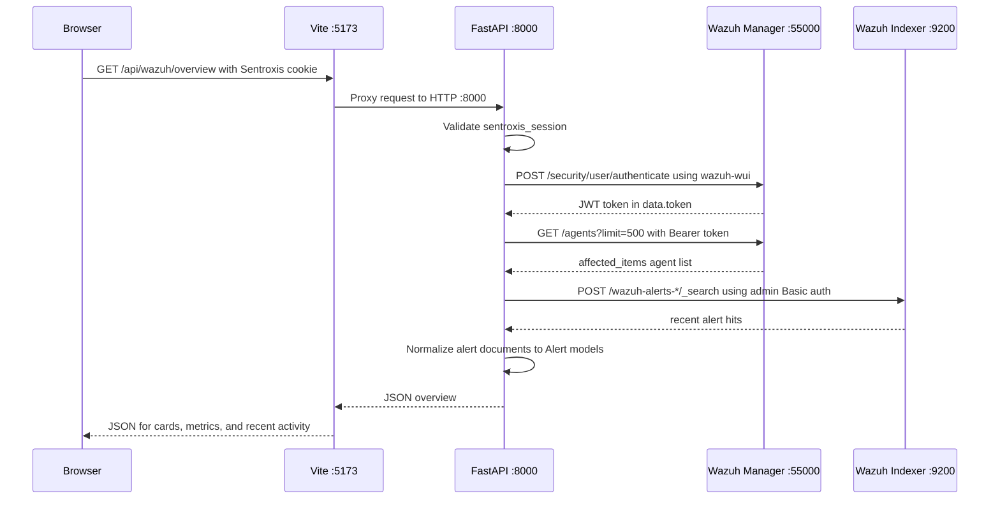

# Sentroxis Copilot Wazuh Integration Architecture

**Document status:** Current implementation reference  
**Scope:** Wazuh installation, startup, dashboard embedding, Manager API integration, Indexer alert retrieval, Sentroxis widgets, authentication, troubleshooting, and contributor boundaries  
**Author:** Manus AI

## 1. Purpose and implementation summary

This document explains how the Sentroxis Copilot project connects a project-local Wazuh single-node deployment to the Sentroxis React/FastAPI application. It is intended for operators who install and run the project, developers who modify the Wazuh integration, and contributors who need to avoid crossing into the separate Velociraptor workstream.

The integration has two independent presentation paths. The **native Wazuh Dashboard** is displayed directly in a browser iframe through a local Nginx HTTPS proxy. It is not rendered or reimplemented by FastAPI. The **Sentroxis telemetry widgets** use a protected FastAPI endpoint that authenticates to the Wazuh Manager API for live agent inventory and to the Wazuh Indexer for recent alert search. The browser receives normalized data from FastAPI rather than Wazuh credentials. The unified root-level `install.py` entrypoint creates the Sentroxis account first; the initial password becomes the Wazuh Indexer/Dashboard `admin` password, while internal Wazuh service passwords are generated automatically.

> **Important distinction:** The embedded dashboard is a browser-to-Nginx-to-dashboard path. The custom widgets are a browser-to-Vite-to-FastAPI-to-Wazuh path. They share the same Wazuh deployment but are not the same request pipeline.

## 2. System topology

The current target is a single AMD64/x86-64 Linux machine running Docker Compose, the Sentroxis backend, and the Sentroxis frontend. Wazuh is pinned to version 4.7.5 by the installer. The project-local `.wazuh` directory contains the cloned Wazuh Docker deployment, generated certificates, Compose configuration, and persistent Docker-managed storage. The installer also supports an AMD64/x86-64 Windows host when it is run inside a WSL 2 Linux distribution connected to Docker Desktop. It does not run from ordinary PowerShell, Git Bash, macOS, ARM64, or unsupported Linux distributions. The Wazuh Docker host requires at least four CPU cores, 12 GiB RAM for this project’s SRS preflight, 80 GiB free disk space, and `vm.max_map_count=262144`.

```mermaid
flowchart LR
    Agent[Wazuh Agent<br/>Kali/Linux/Windows] -->|1514/1515/514 UDP| Manager[Wazuh Manager<br/>Docker :55000 API]
    Manager -->|Filebeat HTTPS<br/>alerts.json| Indexer[Wazuh Indexer<br/>OpenSearch :9200]
    Indexer --> Dashboard[Wazuh Dashboard<br/>container :5601]
    Dashboard --> Proxy[Nginx TLS Proxy<br/>host :443]
    Proxy --> Browser[User Browser]
    Browser -->|iframe https://localhost/| Proxy
    Browser -->|relative /api/*| Vite[Vite Frontend<br/>https://localhost:5173]
    Vite -->|proxy /api to HTTP| FastAPI[Sentroxis FastAPI<br/>http://127.0.0.1:8000]
    FastAPI -->|JWT login + /agents| Manager
    FastAPI -->|Basic auth + _search| Indexer
    FastAPI --> SQLite[(Sentroxis SQLite<br/>local cases/alerts/auth)]
```



### 2.1 Platform execution paths

| Host | Required execution path | Installer behavior |
|---|---|---|
| Ubuntu/Debian/Fedora/RHEL-family/Amazon Linux/CentOS-family AMD64 Linux | Run `./install.py` or `sudo ./wazuh_installation.sh` from the Linux shell | Installs or uses Docker Engine and Compose. |
| Windows AMD64 | Install Docker Desktop with WSL 2 enabled, enable integration for the selected Linux distribution, then run the installer inside WSL 2 | Uses Docker Desktop through the WSL 2 Docker integration; it does not install a separate Docker daemon inside WSL. |
| macOS, Git Bash, ordinary PowerShell, ARM64, or unsupported Linux | Use a supported Linux VM or supported WSL 2 environment | Stops with a platform-specific prerequisite message. |

### 2.2 Wazuh endpoint enrollment workflow

The Agent Management page now includes a dedicated Wazuh endpoint section above the unchanged Velociraptor package workflow. It mirrors the native Wazuh Dashboard deployment wizard: select the endpoint package and architecture, enter the Manager address, skip the optional agent-name step so the endpoint hostname is used, then run the generated installation and start commands [3]. The optional repository-update disabling step is intentionally omitted.

| Step | Operator action | System behavior |
|---|---|---|
| 1. Select package | Select RPM/DEB, MSI, Intel macOS, or Apple silicon macOS. | The frontend sends the selected package identifier to FastAPI. |
| 2. Enter Manager address | Enter the Wazuh Manager IP address or FQDN. | FastAPI validates the address and prepares OS-specific deployment variables. |
| 3. Skip optional agent name | Leave agent naming untouched. | The Wazuh endpoint uses its hostname as the agent name, matching the native wizard’s default. |
| 4. Install and start | Run the displayed install command, followed by the displayed start command on the endpoint. | The package configures communication with the Manager; Sentroxis does not execute endpoint commands remotely. |
| 5. Verify | Select **Refresh** after the endpoint starts. | The backend reads the live Manager inventory and displays the endpoint when it is reporting. |

### 2.3 Network endpoints

| Component | Host-facing endpoint | Internal endpoint | Role in the integration |
|---|---|---|---|
| Sentroxis frontend | `https://localhost:5173` | Vite development server | Serves React pages and proxies `/api` requests. |
| Sentroxis backend | `http://localhost:8000` | FastAPI/Uvicorn | Authenticates Sentroxis users and exposes application APIs. |
| Wazuh Dashboard proxy | `https://localhost/` on TCP 443 | Nginx to `https://wazuh.dashboard:5601` | Provides the iframe-compatible native dashboard endpoint. |
| Wazuh Dashboard | Usually not published directly | `https://wazuh.dashboard:5601` | Native Wazuh UI used by the iframe and standalone browser access. |
| Wazuh Manager API | `https://127.0.0.1:55000` | Manager container port 55000 | Supplies JWT-authenticated agent inventory. |
| Wazuh Indexer | `https://127.0.0.1:9200` | `https://wazuh.indexer:9200` | Stores/searches indexed Wazuh alerts. |
| Wazuh agent transport | TCP 1514/1515 and UDP 514 | Manager listeners | Carries agent events and enrollment/communication traffic. |

The Manager API is bound to localhost by default. The Indexer and Dashboard are reached by the backend through host-published ports for this single-machine MVP. The endpoint deployment route is `POST /api/wazuh/agents/deploy`; it requires an authenticated analyst/admin session and an explicit confirmation flag. The browser receives only the new agent’s enrollment instructions; the Wazuh API token and service credentials remain in FastAPI. In a production deployment, use a private network, trusted CA certificates, least-privilege service accounts, and tighter firewall policy. Wazuh documents the Docker single-node architecture and password procedures in its official deployment guidance [1] [2].

## 3. Installation pipeline

### 3.1 Entry point

The user runs:

```bash
sudo ./wazuh_installation.sh
```

`wazuh_installation.sh` is the direct Wazuh installation entry point and is also invoked by the unified root-level `install.py` menu. In unified mode, the initial Sentroxis password is handed to it through a protected temporary environment file; internal Wazuh service passwords are generated automatically. The installation script remains deliberately separate from `startup.sh`: installation provisions infrastructure and credentials, while startup starts infrastructure that is already installed and then starts the Sentroxis application.

### 3.2 Installer stages

| Stage | Implemented behavior | Important output |
|---|---|---|
| Host preflight | Checks supported Linux distribution, x86-64 architecture, memory, storage, Docker, and Compose. | Installation either stops early or proceeds. |
| Docker preparation | Installs Docker/Compose and `python3-bcrypt` if missing. | Docker service available. |
| Project-local deployment | Clones or updates the official Wazuh Docker repository into `<clone>/.wazuh`. | `.wazuh/single-node/` becomes the deployment root. |
| Version pinning | Uses Wazuh tag `v4.7.5` unless overridden with a compatible `WAZUH_VERSION`. | Consistent Manager, Indexer, Dashboard versions. |
| Credential capture | Direct mode can prompt for three values; unified mode supplies the initial Sentroxis password as the Indexer/Dashboard `admin` password and generates internal service values. | Passwords remain protected and are not placed in command-line arguments. |
| Indexer credential configuration | Generates bcrypt hashes for `admin` and `kibanaserver` and writes them to `internal_users.yml`. | No plaintext Indexer password in the users file. |
| Manager/Dashboard configuration | Writes `INDEXER_PASSWORD`, `API_USERNAME=wazuh-wui`, and `API_PASSWORD` into Compose/configuration files. | Manager Filebeat and Dashboard use the same current credentials. |
| TLS | Generates or preserves the official Wazuh certificates. | Certificate material under `.wazuh/single-node/config/wazuh_indexer_ssl_certs/`. |
| Embed proxy | Creates `docker-compose.sentroxis.yml` and `sentroxis-nginx.conf`. | Nginx owns host port 443. |
| Security bootstrap | Starts the Indexer and runs `securityadmin.sh` with the certificate/key pair and `internal_users.yml`. | Persistent Indexer security configuration is updated. |
| Readiness | Recreates Manager, Dashboard, and proxy; checks API and dashboard HTTP reachability. | Operator receives container/readiness output. |
| Backend credential bridge | Writes `runtime/wazuh-api.env`, ignored by Git and mode `600`. | Sentroxis backend can authenticate without browser-held Wazuh secrets. |

### 3.3 Credential roles

In unified mode, the initial Sentroxis password is assigned to the visible Wazuh/Indexer `admin` account. The installer generates separate random values for the internal `kibanaserver` and Wazuh API `wazuh-wui` accounts. The **Indexer admin password** authenticates the OpenSearch-compatible Indexer account `admin` and is the password the user enters when signing in to the native Dashboard as `admin`. The generated Dashboard service password is applied to `kibanaserver`, and the generated API password is used by `wazuh-wui`.

| Credential | Runtime variable | Consumer |
|---|---|---|
| Indexer admin | `WAZUH_INDEXER_PASSWORD` | Sentroxis Indexer client; Manager Filebeat; Dashboard Indexer connection. |
| Dashboard service | `WAZUH_DASHBOARD_PASSWORD` | Internal `kibanaserver` hash/config path; not normally entered by the user. |
| Manager API | `WAZUH_API_PASSWORD` | Wazuh Manager API account `wazuh-wui`; Dashboard Wazuh API connection. |

The generated runtime file contains endpoints, usernames, and passwords for the local backend process:

```text
WAZUH_MANAGER_API_URL=https://127.0.0.1:55000
WAZUH_INDEXER_URL=https://127.0.0.1:9200
WAZUH_API_USER=wazuh-wui
WAZUH_API_PASSWORD=<generated value>
WAZUH_DASHBOARD_PASSWORD=<generated value>
WAZUH_INDEXER_USER=admin
WAZUH_INDEXER_PASSWORD=<Sentroxis admin password>
```

This file must never be committed, pasted into an issue, or displayed in a log. The installer adds it to the ignored `runtime/` paths.

## 4. Startup pipeline

The normal application command is:

```bash
./startup.sh
```

The startup sequence is:

```text
1. Resolve the repository root.
2. Locate .wazuh/single-node/docker-compose.yml and docker-compose.sentroxis.yml.
3. Start the installed Wazuh Compose stack with `docker compose up -d`.
4. Load runtime/wazuh-api.env into the backend process environment.
5. Recreate the Python virtual environment and install requirements.
6. Generate the Sentroxis frontend localhost certificate if absent.
7. Install frontend dependencies.
8. Run backend tests, frontend lint, frontend tests, and frontend build.
9. Start FastAPI on 0.0.0.0:8000.
10. Start Vite HTTPS on 0.0.0.0:5173 with /api proxying to 127.0.0.1:8000.
```

`start.sh` remains only a compatibility wrapper that delegates to `startup.sh`. Startup does not install Wazuh, regenerate Wazuh credentials, enroll an endpoint, enable active response, or run the Velociraptor wizard.

## 5. Native Wazuh Dashboard display pipeline

### 5.1 What is displayed

The Wazuh tab embeds the actual native Wazuh Dashboard application. Sentroxis does not recreate Wazuh’s navigation, visualizations, login, saved objects, or Dev Tools. The React page creates an iframe whose source is constructed as:

```javascript
const dashboardUrl = `https://${window.location.hostname}/`
<iframe src={dashboardUrl} title="Wazuh dashboard" />
```

When the user opens Sentroxis at `https://localhost:5173`, the iframe source becomes `https://localhost/`. When the user opens Sentroxis using a LAN hostname, the source follows that hostname.

### 5.2 Why Nginx is required

The upstream Dashboard response normally contains browser framing protections such as `X-Frame-Options: sameorigin`. The Sentroxis frontend uses a different port, so the upstream header can prevent the browser from rendering the Dashboard inside the iframe. The project-local Nginx proxy terminates HTTPS on port 443, forwards requests to the internal Dashboard on port 5601, hides the upstream framing headers, and adds a scoped `Content-Security-Policy` permitting local Sentroxis origins.

The relevant proxy behavior is:

```nginx
proxy_hide_header X-Frame-Options;
proxy_hide_header Content-Security-Policy;
add_header Content-Security-Policy "frame-ancestors 'self' http://localhost:* http://127.0.0.1:*" always;
proxy_pass https://wazuh.dashboard:5601;
proxy_ssl_verify off;
proxy_cookie_flags ~ secure samesite=none;
```

This is a local self-signed-certificate development/MVP arrangement. It should not be exposed publicly without replacing certificates, restricting `frame-ancestors`, controlling cookies, and placing the endpoint behind appropriate network controls.

### 5.3 Browser request sequence

```text
Browser loads https://localhost:5173.
React renders Wazuh.jsx.
The iframe requests https://localhost/.
Nginx on host port 443 receives the request.
Nginx proxies it to https://wazuh.dashboard:5601.
The Dashboard loads its own JavaScript, API calls, saved objects, and login flow.
The browser stores/uses Dashboard cookies for the proxied HTTPS origin.
The user interacts with the native Dashboard inside the iframe.
```

FastAPI is not in this iframe request path. Therefore, a Dashboard “server is not ready yet” message must be diagnosed through Dashboard, Indexer, and Manager connectivity/logs rather than through the React widget code.

## 6. Sentroxis authentication and browser-to-backend path

The application has its own local authentication layer. A user registers or logs in through Sentroxis, and FastAPI sets the `sentroxis_session` cookie. Frontend calls use `authRequest()` from `frontend/src/auth/AuthProvider.jsx`:

```javascript
fetch(path, {
  credentials: 'include',
  headers: { 'Content-Type': 'application/json' },
  ...options,
})
```

The browser uses relative paths such as `/api/wazuh/overview`. Vite proxies those paths to `http://127.0.0.1:8000`, so Wazuh credentials are never sent from the browser. FastAPI authenticates the Sentroxis session before allowing the live overview route.



## 7. Live widget data pipeline

### 7.1 Backend entry point

The backend route is defined in `backend/main.py`:

```text
GET /api/wazuh/overview
Authentication: Sentroxis session cookie required
Response: agents, alerts, errors, timestamp
```

The route delegates to `WazuhService.live_overview()`. It returns a safe partial response if one Wazuh subsystem is unavailable. It does not expose Wazuh passwords, JWTs, full exception traces, or connection credentials to the browser.

Conceptually, the response has this shape:

```json
{
  "agents": [],
  "alerts": [],
  "errors": [],
  "timestamp": "2026-08-27T00:00:00+00:00"
}
```

### 7.2 Manager API path for agents

The backend performs these read-only operations:

```text
POST https://127.0.0.1:55000/security/user/authenticate
Basic authentication: wazuh-wui + WAZUH_API_PASSWORD
Expected response: data.token

GET https://127.0.0.1:55000/agents?limit=500
Authorization: Bearer <in-memory JWT>
Expected response: data.affected_items
```

The JWT is held only during the request and is not persisted. Agent pagination is bounded at 500 records. The frontend receives raw Wazuh agent fields such as `id`, `name`, `ip`, `status`, `os`, `version`, and `lastKeepAlive`.

### 7.3 Indexer path for alerts

The backend sends a bounded OpenSearch query:

```json
{
  "size": 100,
  "sort": [{"timestamp": {"order": "desc"}}],
  "query": {"match_all": {}}
}
```

The request is sent to:

```text
POST https://127.0.0.1:9200/wazuh-alerts-*/_search
Basic authentication: admin + WAZUH_INDEXER_PASSWORD
```

Each Indexer hit’s `_source` is normalized by `WazuhService.normalize_alert()`. The normalizer extracts the Wazuh `rule` and `agent` objects, derives severity from the rule level, maps the event to the project `Alert` model, and applies the existing MITRE enrichment helper. The response is limited to 100 recent alerts to avoid unbounded browser payloads.

The current live overview is read-through rather than a background ingestion worker: fetched live alerts are returned to the current request and are not automatically inserted into Sentroxis SQLite. The existing `POST /api/alerts/ingest` route and local alert database remain available for explicit application ingestion, analysis, investigation, and audit workflows.

### 7.4 Wazuh tab mappings

`frontend/src/pages/Wazuh.jsx` calls `/api/wazuh/overview` on initial render and when the user selects **Refresh telemetry**.

| Widget | Data source | Mapping |
|---|---|---|
| Signals | Indexer alerts | `alerts.length` |
| Machines | Manager agents | `agents.length` |
| Critical | Indexer alerts | Count where `alert.severity === 'critical'` |
| Machine card name | Manager agent | `agent.name`, falling back to `agent.id` |
| Machine card IP | Manager agent | `agent.ip` |
| Machine card alert count | Combined response | Number of live alerts whose `agent_name` equals the agent name |
| Machine card last seen | Manager agent | `agent.lastKeepAlive` |
| Recent activity | Indexer alerts | First five normalized alerts, including title, agent, MITRE technique/tactic, severity, and timestamp |
| Error message | Backend response | Joined `errors` array displayed below the telemetry sections |

### 7.5 Agent Management mappings

`frontend/src/pages/Agents.jsx` calls the same `/api/wazuh/overview` route. This prevents the Wazuh tab and Agent Management tab from using different definitions of “discovered agent.” The page displays live Manager agents, while the deployment command area remains intentionally non-automatic. The Wazuh integration does not execute commands on endpoints or silently install agents.

## 8. Existing local alert and AI pipeline

The live overview path should not be confused with the existing local alert workflow:

```text
POST /api/alerts/ingest
  -> WazuhService.normalize_alert(payload)
  -> persist_alert(Alert) in Sentroxis SQLite
  -> GET /api/alerts reads SQLite rows
  -> GET /api/alerts/{id}/analysis uses the advisory AI agent
  -> POST /api/investigations creates a local investigation
```

The local route is useful for explicit ingestion and case workflows. The live Wazuh route is intended to give the Wazuh and Agent Management screens current infrastructure telemetry. Future work may add idempotent persistence, incremental cursors, background polling, or event-driven ingestion, but those changes must preserve bounded payloads, auditability, read-only defaults, and explicit response approval.

## 9. Failure interpretation guide

### 9.1 Manager API HTTP 401

A Manager 401 means the Wazuh API credentials are invalid or the runtime file contains the wrong username/password pair. The Docker API account for this deployment is `wazuh-wui`. Confirm that `runtime/wazuh-api.env` was generated by the same installation run that configured the Manager container. Do not paste the password into a report.

### 9.2 Manager API HTTP 400 on `/agents`

A Manager 400 usually indicates an invalid endpoint parameter or field selection. The current client intentionally uses only the bounded `limit=500` parameter and avoids a version-specific `select` list. If a future Wazuh version is adopted, validate its `/agents` query contract before adding fields.

### 9.3 Indexer HTTP 401

An Indexer 401 means the `admin` password in the backend runtime environment is not the password in the active Indexer security database. It also commonly appears in Manager logs as Filebeat `401 Unauthorized` and in Dashboard logs as `kibanaserver` authentication failure. These are strong indicators that the Compose environment values, bcrypt hashes, and persistent security configuration are out of sync.

The safe first recovery action is:

```bash
cd /path/to/sentroxis-copilot
git pull origin main
sudo ./wazuh_installation.sh
```

Use the intended Indexer admin password consistently, allow the installer to apply `internal_users.yml` through `securityadmin.sh`, and do not run `docker compose down -v` unless indexed data is intentionally disposable. Wazuh’s official password procedure requires updating Compose values, user hashes, and the running Indexer security configuration [1].

### 9.4 Dashboard “server is not ready yet”

This message is normally a Dashboard dependency problem rather than a React problem. Check the Indexer first, then the Dashboard and Manager logs:

```bash
cd /path/to/sentroxis-copilot/.wazuh/single-node
sudo docker compose \
  -f docker-compose.yml \
  -f docker-compose.sentroxis.yml ps

sudo docker compose \
  -f docker-compose.yml \
  -f docker-compose.sentroxis.yml logs --tail=120 \
  wazuh.indexer wazuh.dashboard wazuh.manager
```

Expected state is `Up` for the Indexer, Manager, Dashboard, and Nginx proxy. A Dashboard that is `Up` can still be functionally unavailable if its Indexer authentication is failing.

### 9.5 Dashboard iframe refuses to connect

Check the following in order:

| Check | Command or observation |
|---|---|
| Proxy state | `docker compose ps` shows `wazuh.dashboard_proxy` as `Up`. |
| Host endpoint | `curl -sk -D - https://127.0.0.1/ -o /dev/null`. |
| Redirect | A healthy unauthenticated Dashboard commonly redirects to `/app/login`. |
| Framing headers | Proxy response should not retain the restrictive upstream `X-Frame-Options: sameorigin`. |
| Certificate | Browser has accepted the local self-signed certificate for the endpoint. |
| Cookie behavior | Dashboard is reached through HTTPS and the proxy applies secure cookie flags. |

## 10. Validation checklist

The following checks validate the full pipeline without printing secrets:

```bash
cd /path/to/sentroxis-copilot
set -a
source runtime/wazuh-api.env
set +a

printf 'Manager API HTTP status: '
curl -sk -u "$WAZUH_API_USER:$WAZUH_API_PASSWORD" \
  -X POST 'https://127.0.0.1:55000/security/user/authenticate?raw=true' \
  -o /tmp/wazuh-token -w '%{http_code}\n'
printf 'Manager token bytes: '
wc -c < /tmp/wazuh-token

printf 'Indexer HTTP status: '
curl -sk -u "$WAZUH_INDEXER_USER:$WAZUH_INDEXER_PASSWORD" \
  -o /dev/null -w '%{http_code}\n' https://127.0.0.1:9200/
rm -f /tmp/wazuh-token
```

| Layer | PASS condition |
|---|---|
| Docker | Indexer, Manager, Dashboard, and proxy are `Up`. |
| Manager API | Authentication returns HTTP 200 and a non-zero token length. |
| Manager agents | Authenticated `/agents?limit=500` returns JSON with `data.affected_items`. |
| Indexer | Basic-authenticated `GET /` returns HTTP 200. |
| Filebeat | Manager logs do not continuously report Indexer 401 errors. |
| Dashboard | `https://localhost/` redirects to or displays the native Dashboard login. |
| Sentroxis backend | Authenticated `GET /api/wazuh/overview` returns agents/alerts/errors/timestamp JSON. |
| Wazuh widgets | Connected agents and recent alerts appear after refresh. |
| iframe | Native Dashboard is interactive inside the Wazuh tab. |

For production-style deployments, replace `-k`/`verify=False` with trusted CA verification. The current self-signed mode is explicitly for the local/private MVP.

## 11. Code ownership and file map

| File | Responsibility |
|---|---|
| `wazuh_installation.sh` | Installs/pins Wazuh, configures credentials, generates/preserves certificates, bootstraps Indexer security, creates proxy configuration, and checks readiness. |
| `startup.sh` | Starts already-installed Wazuh services, loads runtime credentials, validates/builds Sentroxis, and starts FastAPI/Vite. |
| `start.sh` | Compatibility wrapper to `startup.sh`. |
| `backend/ingestion/wazuh_service.py` | Wazuh API/Indexer client boundary, live overview retrieval, alert normalization, severity/MITRE enrichment. |
| `backend/main.py` | FastAPI route registration, Sentroxis session enforcement, local alert workflow, and `/api/wazuh/overview`. |
| `frontend/src/pages/Wazuh.jsx` | Native Dashboard iframe, live summary cards, machine cards, recent alert display, and refresh action. |
| `frontend/src/pages/Agents.jsx` | Live Wazuh agent inventory and Wazuh enrollment UI. |
| `frontend/src/auth/AuthProvider.jsx` | Sentroxis session calls and relative authenticated API request helper. |
| `frontend/vite.config.js` | HTTPS development server and `/api` proxy to FastAPI. |
| `runtime/wazuh-api.env` | Generated local secret bridge; ignored and mode `600`; never commit. |
| `.wazuh/single-node/` | Project-local Wazuh Docker deployment and its generated configuration/certificates. |

## 12. Velociraptor boundary

The Wazuh integration must remain independent from the Velociraptor workstream. Wazuh owns detection telemetry, alert indexing, the native Dashboard, Manager API agent inventory, and Wazuh enrollment UI. Velociraptor owns endpoint evidence collection, its own installation/configuration workflow, its own runtime/API behavior, and any future service startup integration assigned to that contributor.

Do not modify Velociraptor scripts, generated configuration, API routes, or startup behavior as part of a Wazuh-only change. The four-tab frontend can contain a reserved Velociraptor tab and a reserved Velociraptor agent-management section, but those placeholders must not be treated as implemented Wazuh functionality.

## 13. Security boundaries

The application follows a read-only-first integration model. Wazuh credentials remain server-side, JWTs are not persisted, Manager and Indexer requests are bounded, and the browser receives normalized data rather than Wazuh secrets. The AI co-pilot is advisory and does not execute active response, shell commands, arbitrary Wazuh API mutations, or endpoint enrollment. The native Dashboard remains interactive because it is Wazuh’s own UI, but its access is still protected by the Dashboard login and local HTTPS endpoint.

The current implementation uses self-signed certificates and disabled certificate verification for local connections because the single-machine MVP generates private certificates. This is not an acceptable production trust model. Production hardening requires a trusted internal/public CA, strict hostname verification, least-privilege service accounts, private API exposure, firewall controls, rate limiting, backups, log retention, and tested rollback procedures.

## 14. References

[1]: https://documentation.wazuh.com/current/deployment-options/docker/changing-default-password.html "Wazuh: Changing the default password of Wazuh users"
[2]: https://documentation.wazuh.com/current/user-manual/api/getting-started.html "Wazuh: Getting started with the Wazuh Server API"
[3]: https://documentation.wazuh.com/current/user-manual/indexer-api/getting-started.html "Wazuh: Getting started with the Wazuh Indexer API"
